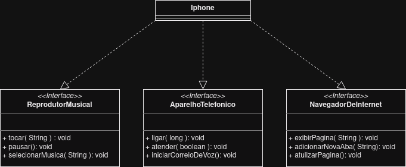

# Projeto de diagrama de classes do Iphone

Nesse projeto foi proposto que eu trabalhasse com UML (Unified Modeling Language) para representar as classes e interfaces de um Iphone.

[clique aqui](https://github.com/digitalinnovationone/trilha-java-basico/tree/main/desafios/poo) para saber mais.

